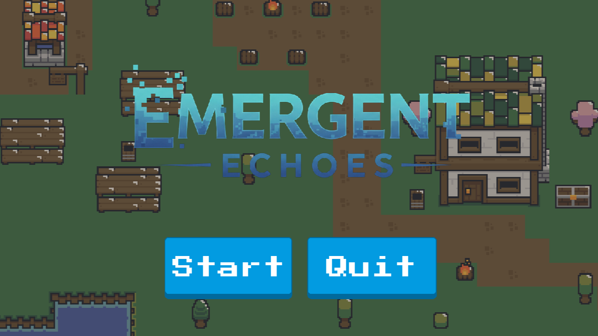
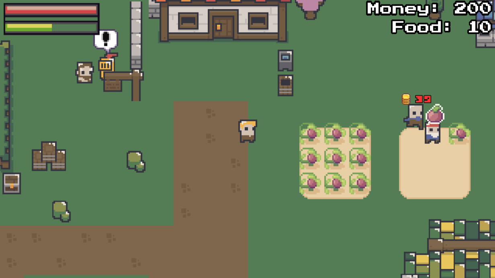

# Emergent Echoes


[](LICENSE)




## 📄 Full Paper

The full ACM paper can be found here: http://dx.doi.org/10.13140/RG.2.2.16168.48642

## 📝 Description

This repository contains the implementation of an undergraduate thesis project entitled **"A Resource-Based AI Decision Algorithm for Invoking Narratives Through Non-Playable Characters in a 2D Simulation"** from Xavier University - Ateneo de Cagayan, Department of Computer Science.

The study introduces a novel resource-based decision technique designed to invoke dynamic narratives through the behaviors of Non-Playable Characters (NPCs) within a 2D spatial environment. The core objective was to develop and assess the technique's capacity to create emotionally engaging NPCs that enhance narrative immersion through procedurally generated relationships and emergent storylines. This project aims to demonstrate how intelligent NPC behavior, driven by internal resource management, can lead to complex and unpredictable narrative developments in interactive simulations.

## 📖 Table of Contents

- [📝 Description](#-description)
- [✨ Features](#-features)
- [⚙️ Technical Overview](#️-technical-overview)
  - [🍴 Resource-Based Decision Algorithm](#-resource-based-decision-algorithm)
  - [🌳 Behavior Trees (Beehave)](#-behavior-trees-beehave)
  - [🌀 Procedural Content Generation (PCG)](#-procedural-content-generation-pcg)
  - [🗨️ Narrative Invocation](#️-narrative-invocation)
- [💻 Technologies Used](#️-technologies-used)
  - [➕ Addons](#-addons)
- [🛠️ Setup Project](#-setup-project)
  - [🍴 Prerequisites](#-prerequisites)
  - [🚀 Install Project](#-install-project)
- [🤝 Contributing and Support](#-contributing-and-support)
  - [📩 Bug Report](#-bug-report)
- [📜 Credits](#-credits)
- [📞 Contact Me](#-contact-me)
- [📋 License](#-license)

## ✨ Features

👉 **Dynamic NPC Behavior**: NPCs exhibit intelligent and adaptive behaviors driven by an internal resource management system (e.g., hunger, companionship, duty, money).

👉 **Emergent Narrative Generation**: Complex storylines and character relationships emerge organically from NPC interactions and decisions, rather than being pre-scripted.

👉 **Resource-Based Decision Making**: NPCs prioritize actions based on their current resource levels, leading to realistic and varied responses to environmental stimuli and other characters.

👉 **2D Simulation Environment**: A custom 2D sandbox environment built to visualize and test the emergent narrative system.

👉 **Behavior Tree Integration**: Utilizes behavior trees for flexible and modular AI logic, allowing for complex decision-making flows.

👉 **Procedural Relationship Generation**: Relationships between NPCs are not hardcoded but evolve based on their interactions, resource exchanges, and shared experiences.

👉 **Interactive Elements**: The player can interact with NPCs, influencing their resources and, consequently, their behaviors and the unfolding narrative.

👉 **Debugging Tools**: Includes integrated debugging tools for monitoring NPC states, resource levels, and behavior tree execution.

## ⚙️ Technical Overview

### 🍴 Resource-Based Decision Algorithm

The central innovation of this project lies in its resource-based decision algorithm. Instead of relying on rigid state machines or predefined scripts, each Non-Playable Character (NPC) is endowed with a set of internal "resources" (e.g., `Food`, `Money`, `Companionship`, `Duty`, `Satiation`). These resources have ideal ranges and thresholds. When a resource falls below a certain threshold or exceeds an upper limit, it triggers a "need" or "desire" within the NPC.

The decision algorithm works as follows:

1. **Resource Evaluation**: At each simulation tick, the NPC evaluates the current state of all its resources.
2. **Need Prioritization**: Based on the resource levels, a priority score is calculated for various potential actions. For instance, an NPC with very low `Food` will highly prioritize "Eat Food" or "Buy Food" actions. An NPC with low `Companionship` might prioritize "Interact with Peer" actions.
3. **Action Selection**: The NPC selects the action with the highest priority. This action then becomes its current goal.
4. **Behavior Tree Execution**: The selected action corresponds to a specific behavior tree. The NPC then attempts to execute this behavior tree to satisfy its need.
5. **Dynamic Resource Fluctuation**: As actions are performed, the NPC's resources are dynamically updated. For example, "Eat Food" increases `Satiation` and decreases `Food` (if food is consumed from inventory). "Steal Money" might increase `Money` but decrease `Duty` (representing a moral resource).

This dynamic interplay between resources and actions leads to emergent behaviors and, consequently, emergent narratives. For example, an NPC who is consistently hungry might resort to stealing, leading to conflicts with other NPCs or the player.

### 🌳 Behavior Trees (Beehave)

The project leverages [Beehave](https://bitbra.in/beehave/#/), a Godot Engine addon for implementing behavior trees. Behavior trees provide a hierarchical and modular way to structure AI logic, making it more readable, scalable, and easier to debug compared to traditional state machines.

Each high-level action determined by the resource-based decision algorithm (e.g., "Eat Food," "Patrol," "Steal Money") is implemented as a distinct behavior tree. These trees are composed of various nodes:

- **Composites (Sequence, Selector, Parallel)**: Control the flow of execution among child nodes.
  - **Sequence**: Executes children in order until one fails or all succeed.
  - **Selector**: Executes children in order until one succeeds or all fail.
  - **Parallel**: Executes all children simultaneously.
- **Decorators (Inverter, Limiter, Repeater)**: Modify the outcome or execution of a single child node.
- **Leaves (Actions, Conditions)**: The actual tasks the NPC performs or checks it makes.
  - **Actions**: Direct commands like `MoveToPosition`, `InteractWithTarget`, `HarvestCrop`.
  - **Conditions**: Checks for specific states, such as `IsTargetReached`, `HasMoney`, `AreCropsMatured`.

The modularity of behavior trees allows for easy creation of complex behaviors by combining simpler ones. The visual editor provided by Beehave also aids in understanding and debugging the NPC's decision-making process.

### 🌀 Procedural Content Generation (PCG)

While the core narrative emerges from NPC interactions, elements of Procedural Content Generation (PCG) are utilized to set up the initial conditions and dynamic aspects of the simulation:

- **World State Management**: A `WorldState` singleton manages the global state of the simulation, including registered actors, available resources (e.g., `CropTile` objects), pending crimes, and locations like `Prison` and `Shop`.
- **NPC Agent Initialization**: NPCs are initialized with a set of `Traits` (e.g., `FarmerTrait`, `LawfulTrait`, `ThiefTrait`, `SurvivalTrait`) and initial resource levels. These traits influence how NPCs prioritize and react to resource changes and interactions.
- **Dynamic Resource Updates**: The `ResourceManager` continuously updates global and individual NPC resources based on actions performed in the world (e.g., `FoodResource`, `MoneyResource`).
- **Memory Management**: The `MemoryManager` allows NPCs to remember past interactions and events, which can influence future decisions and relationship dynamics.

### 🗨️ Narrative Invocation

The "invocation" of narratives occurs as a direct consequence of the resource-based AI and behavior tree execution. When an NPC's resources drive it to perform certain actions that deviate from the "norm" or interact with other NPCs in unexpected ways, a narrative beat is created.

Examples of narrative invocation:

- **Conflict**: A hungry NPC (`FoodResource` low) with a `ThiefTrait` might attempt to `StealMoneyFromActor` from another NPC. If caught, this could lead to a `DetainTarget` action by a `LawfulTrait` NPC, resulting in the thief being sent to `Prison`. This sequence of events forms a mini-narrative of crime and punishment.
- **Cooperation**: An NPC with low `Companionship` might seek to `InteractWithTarget` (another NPC or player). If the interaction is successful and resources are exchanged positively, a cooperative relationship might emerge.
- **Survival Stories**: An NPC struggling with `FoodResource` might prioritize `GoToFarm` and `HarvestCrop`, or `GoToMarketToBuyFood`. If these actions are repeatedly unsuccessful, it could lead to the NPC `DeathByBeingHungry`, creating a tragic narrative.

The system is designed to allow these micro-narratives to intertwine and build upon each other, leading to larger, emergent storylines without explicit authorial scripting.

## 💻 Technologies Used

[![Godot][Godot]][Godot-url]

> Version 4.x. The primary game engine used for developing the 2D simulation environment and handling game logic.

[![GDScript][GDScript]][GDScript-url]

> Godot's built-in scripting language, used extensively for NPC AI, game mechanics, and UI.

[![C#][C#]][C#-url]

> Used for some core game logic components and data structures, leveraging Godot's C# support.

### ➕ Addons

- **Beehave Addon**: A behavior tree implementation for Godot Engine, crucial for structuring NPC AI.
- **Dialogic Addon**: A powerful dialogue system for Godot, used for managing NPC conversations and narrative events.

[Godot]: https://img.shields.io/badge/GODOT-%23FFFFFF.svg?style=for-the-badge&logo=godot-engine
[Godot-url]: https://godotengine.org/
[GDScript]: https://img.shields.io/badge/GDScript-%2374267B.svg?style=for-the-badge&logo=godotengine&logoColor=white
[GDScript-url]: https://docs.godotengine.org/en/4.4/tutorials/scripting/gdscript/gdscript_basics.html
[C#]: https://img.shields.io/badge/c%23-%23239120.svg?style=for-the-badge&logo=csharp&logoColor=white
[C#-url]: https://learn.microsoft.com/en-us/dotnet/csharp/

## 🛠️ Setup Project

To get this project up and running in your local computer, follow these step-by-step instructions.

### 🍴 Prerequisites

We need to install or make sure that these tools are pre-installed on your machine:

- [Godot Engine 4.x](https://godotengine.org/)
- [.NET SDK](https://dotnet.microsoft.com/en-us/download) (if you intend to modify or compile the C# scripts). Godot 4.x with C# requires the .NET SDK

### 🚀 Install Project

1. Clone the Repository

```bash
git clone https://github.com/janrizmlibres/emergent-echoes.git
```

2. Open in Godot Engine:

- Open Godot Engine.
- Click on "Import" and navigate to the `emergent-echoes` directory.
- Select the `project.godot` file.
- Godot will import the project. If prompted to convert, you can choose to do so, though it should be compatible with Godot 4.x.

3. Run the Project:

- Once the project is open in the Godot editor, you can run the main scene by pressing `F5` (or clicking the "Play" button in the top right corner).
- The main scene is typically `res://Stages/Island/world.tscn` or `res://Stages/Menu/main_menu.tscn`. If it doesn't run automatically, set one of these as the main scene in Project Settings -> Application -> Run.

## 🤝 Contributing and Support

This repository primarily serves as the public facing artifact of an undergraduate thesis. While direct contributions in the form of pull requests are generally not expected for a completed thesis project, feedback, bug reports, and discussions are highly welcome.

### 📩 Bug Report

If you find a bug, kindly open an issue [here](https://github.com/janrizmlibres/devflow-clone-app/issues/new) by including a description of your problem and the expected result.

## 📜 Credits

I'd like to acknowledge my team, who I had the pleasure to work with in the development of this thesis. Below are their contact details.

👦 Clint Jonathan A. Galendez <br>
Email: 20210021497@my.xu.edu.ph

🧑‍🦱 Xander Allen M. Rola <br>
Email: 20190016434@my.xu.edu.ph

👩 David Napoleon L. Romanillos <br>
Email: 20210022695@my.xu.edu.ph

Lastly, I'd like to express my heartfelt gratitude to our adviser, who contributed to the success of this project:

👨‍🦱 Jun Rangie C. Obispo (Adviser) <br>
Email: jobispo@xu.edu.ph

## 📞 Contact Me

[
](https://www.linkedin.com/in/janrizlibres/)

## 📋 License

This project is licensed under the [MIT](https://choosealicense.com/licenses/mit/) License.

Copyright (c) 2025 Janriz Mathew Libres, Clint Jonathan A. Galendez, Xander Allen M. Rola, David Napoleon L. Romanillos, Jun Rangie C. Obispo
